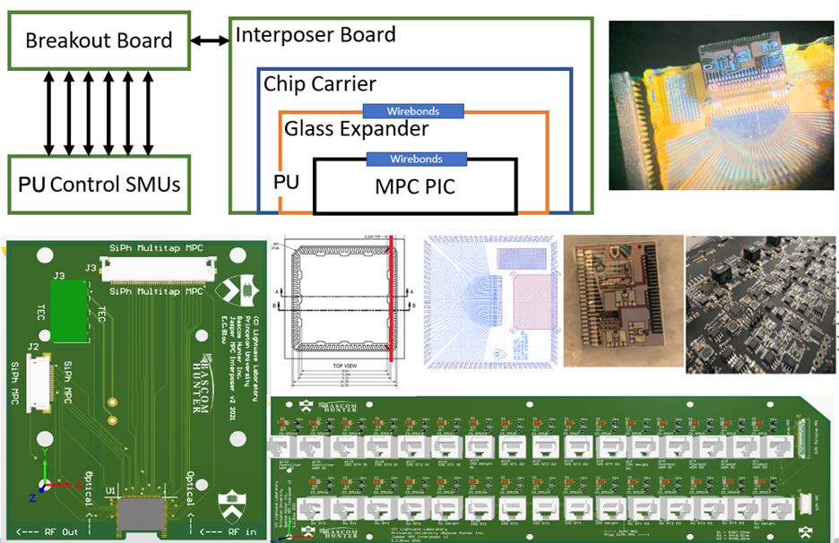
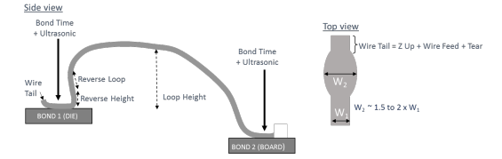

### Photonic Packaging

From my 2023 PhD thesis, step-by-step guide on packaging silicon photonic integrated circuits from an academic perspective.  

Co-authors:  
Simon Bilodeau @simbilod  
Thomas Ferreira de Lima @thomaslima  
Prof. Paul R. Prucnal  

Please feel free to update and contribute as these techniques evolve.

[View Photonic Packaging Manual](https://ericcblow.github.io/PhotonicPackaging/PhotonicPackagingProcessAndEtch.pdf)

Reference: Blow, Eric Charles. Microwave Photonic Interference Cancellation: RF Analysis, III-V and Silicon Integration, Development of Balanced and Hybrid Architectures. Diss. Princeton University, 2024.  

  

 

  

